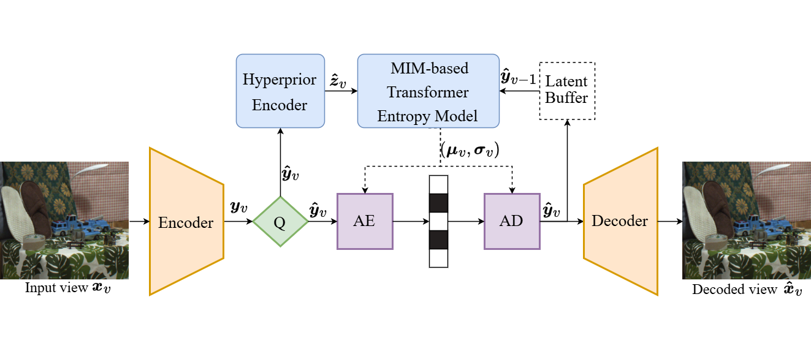
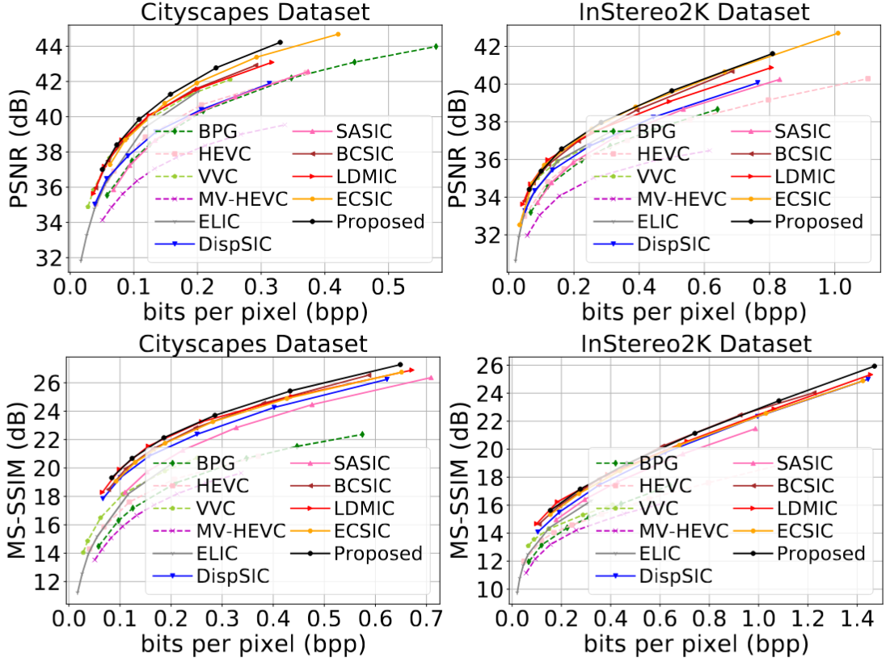
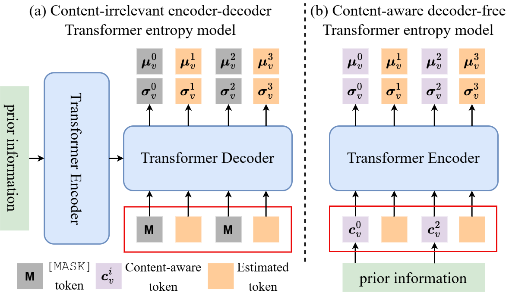

# CAMSIC: Content-aware Masked Image Modeling Transformer for Stereo Image Compression
[](https://mit-license.org/) 
[](https://arxiv.org/abs/2403.08505)
[](https://github.com/Xinjie-Q/CAMSIC)

[[paper](https://arxiv.org/abs/2403.08505)][[code](https://github.com/Xinjie-Q/CAMSIC)]

[Xinjie Zhang](https://xinjie-q.github.io/), [Shenyuan Gao](https://github.com/Little-Podi), [Zhening Liu](https://www.liuzhening.top/), [Jiawei Shao](https://shaojiawei07.github.io/), [Xingtong Ge](https://xingtongge.github.io/), [Dailan He](https://scholar.google.com/citations?user=f5MTTy4AAAAJ&hl=en), [Tongda Xu](https://tongdaxu.github.io/),  [Yan Wang](https://yanwang202199.github.io/), [Jun Zhang📧](https://eejzhang.people.ust.hk/)

(📧 denotes corresponding author.)

This is the official implementation of our paper [CAMSIC](https://arxiv.org/abs/2403.08505), a learning-based stereo image compression framework with a simple image encoder-decoder pair, which uses an elegantly neat but powerful Transformer entropy model based on the proposed content-aware masked image modeling to exploit the relationship between the left and right images. Experimental results show that our proposed method with lower encoding and decoding latency significantly outperforms existing learning-based stereo image compression methods.

<div align=center>

</div>


<div align=center>

</div>

## News

* **2025/6/28**: 🔥 We release our Python code for CAMSIC presented in our paper. Have a try!

* **2024/12/10**: 🌟 Our paper has been accepted by AAAI 2025! 🎉 Cheers!

## Overview



Existing learning-based stereo image codec adopt sophisticated transformation with simple entropy models derived from single image codecs to encode latent representations. However, those entropy models struggle to effectively capture the spatial-disparity characteristics inherent in stereo images, which leads to suboptimal rate-distortion results. In this paper, we propose a stereo image compression framework, named CAMSIC. CAMSIC independently transforms each image to latent representation and employs a powerful decoder-free Transformer entropy model to capture both spatial and disparity dependencies, by introducing a novel content-aware masked image modeling (MIM) technique. Our content-aware MIM facilitates efficient bidirectional interaction between prior information and estimated tokens, which naturally obviates the need for an extra Transformer decoder. Experiments show that our stereo image codec achieves state-of-the-art rate-distortion performance on two stereo image datasets Cityscapes and InStereo2K with fast encoding and decoding speed.

## Quick Started

### Cloning the Repository

The repository contains submodules, thus please check it out with 
```shell
# SSH
git clone git@github.com:Xinjie-Q/CAMSIC.git 
```
or
```shell
# HTTPS
git clone https://github.com/Xinjie-Q/CAMSIC.git
```
After cloning the repository, you can follow these steps to train CAMSIC models. 

### Requirements

```bash
pip install -r requirements.txt
```

If you encounter errors while installing the packages listed in requirements.txt, you can try installing each Python package individually using the pip command.

Before training, you need to download the [Cityscapes](https://www.cityscapes-dataset.com/) and [InStereo2K](https://github.com/YuhuaXu/StereoDataset) datasets. Additionally, place the pretrained [ELIC](https://drive.google.com/file/d/1uuKQJiozcBfgGMJ8CfM6lrXOZWv6RUDN/view) model from the [ELiC-ReImplemetation](https://github.com/VincentChandelier/ELiC-ReImplemetation) project into the `pretrained_ckpt` folder.

#### Compression

```bash
sh ./scripts/train.sh
sh ./scripts/eval.sh
```

## Acknowledgments

Our code was developed based on [CompressAI](https://github.com/InterDigitalInc/CompressAI/). This is a concise and easily extensible neural codec library.

## Citation

If you find our CAMSC method useful or relevant to your research, please kindly cite our paper:

```
@inproceedings{zhang2025camsic,
  title={CAMSIC: Content-aware Masked Image Modeling Transformer for Stereo Image Compression},
  author={Zhang, Xinjie and Gao, Shenyuan and Liu, Zhening and Shao, Jiawei and Ge, Xingtong and He, Dailan and Xu, Tongda and Wang, Yan and Zhang, Jun},
  booktitle={Proceedings of the AAAI Conference on Artificial Intelligence},
  volume={39},
  number={10},
  pages={10239--10247},
  year={2025}
}
```
